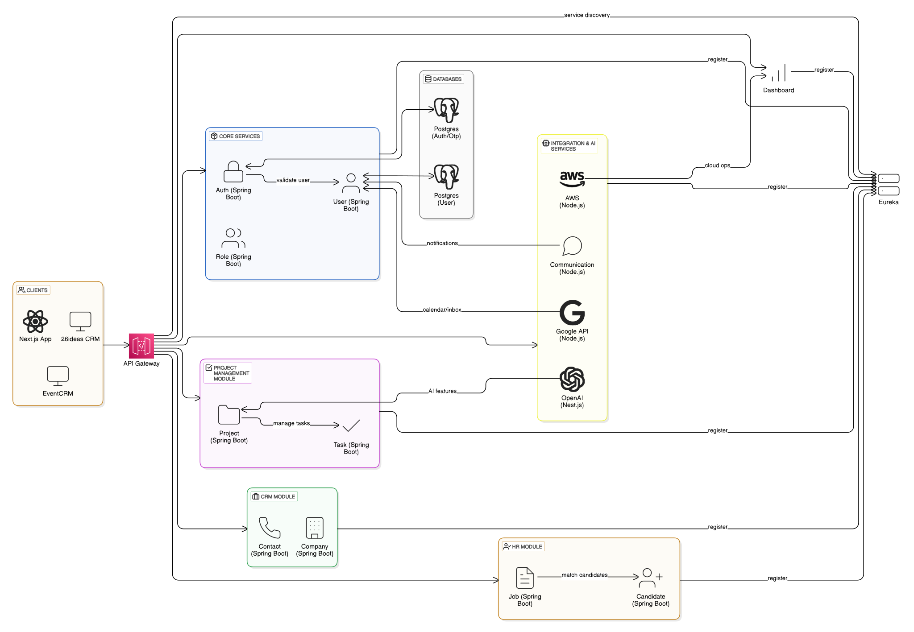
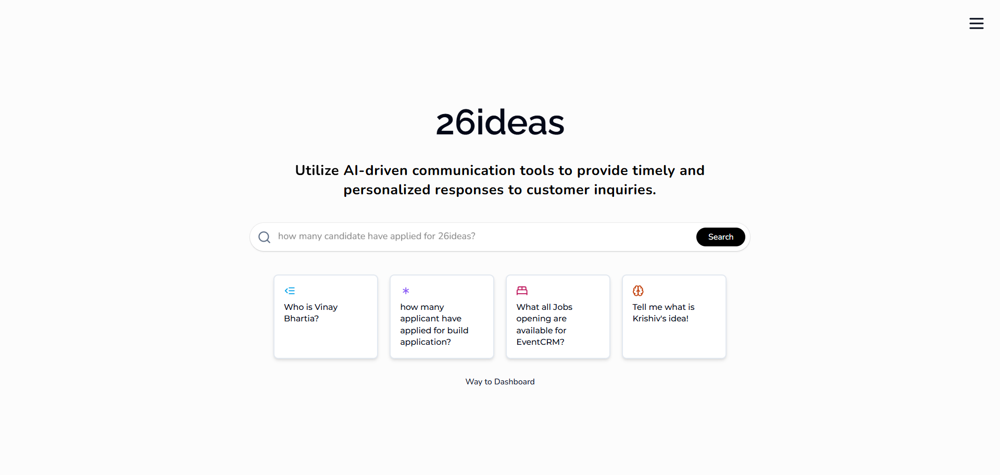
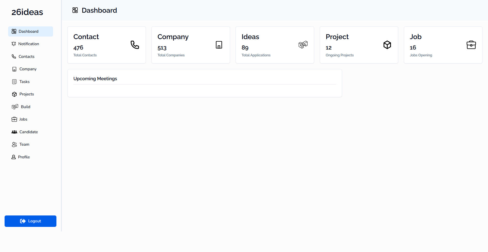
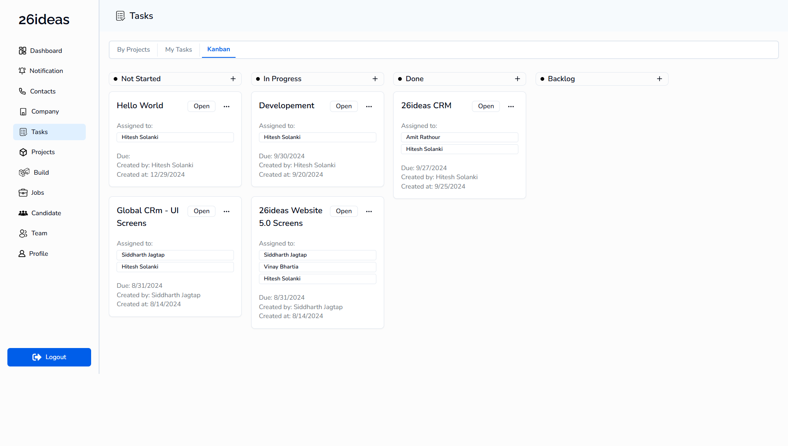
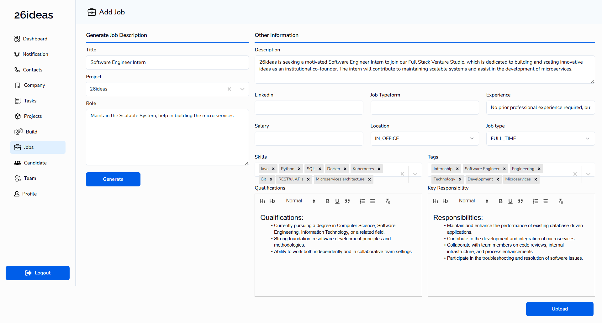

# 26ideas CRM – Microservices Architecture

---

## 🚫 License

This codebase and its components are **confidential and proprietary** to [26ideas](https://26ideas.com/). Redistribution or reuse without permission is strictly prohibited.

---

## Overview

This repository represents the microservices-based architecture used to power **26ideas CRM** and **EventCRM CRM**, two robust business tools for managing customer relationships and events.

> **Note:** Code for this project is not open source due to company IP protection under **26ideas**.

---

## 🌐 Client Applications

Both applications are built using **Next.js** for performant, responsive, and scalable frontends:

- **26ideas CRM** – End-to-end business and team management suite.
- **EventCRM** – Specialized CRM for event-based communication and tracking.

---

## 🧩 Microservices (Server-Side)

The backend architecture follows a fully decoupled **Microservices Pattern** leveraging **Spring Boot**, **Node.js**, and **NestJS**.

| Service Name          | Description                                  | Tech Stack            |
| --------------------- | -------------------------------------------- | --------------------- |
| User Service          | Manages vendor, tenant, super admin users    | Spring Boot, Postgres |
| Auth Service          | Login, OTP, JWT authentication               | Spring Boot, Postgres |
| Contact Service       | Basic CRM contact management                 | Spring Boot           |
| Company Service       | Organization-level data                      | Spring Boot           |
| Job Service           | HR recruitment management                    | Spring Boot           |
| Candidate Service     | Applicant data tracking                      | Spring Boot           |
| Project Service       | Project tracking and analytics               | Spring Boot           |
| Task Service          | Task creation and status updates             | Node.js               |
| OpenAI Service        | AI features (chat, embedding, vector search) | NestJS (Node.js)      |
| Communication Service | WhatsApp and Email messaging integration     | Node.js               |
| Google Service        | Calendar, Gmail API integrations             | Node.js               |
| Role Service          | Role-based access management                 | Java                  |
| AWS Utility           | S3 Uploads, IAM Roles, etc.                  | Node.js               |
| Dashboard Service     | Aggregated data and admin analytics          | Java                  |

---

## 🖼️ Screenshots

### 🔹 26ideas CRM

  
  
  
  

---

## 🧱 Infrastructure

- **Eureka Discovery Server** – For service registry and discovery.
- **API Gateway** – Unified entry point for all services.

---

## 👨‍💻 Developer

Made with ❤️ by [**Hitesh Solanki**](https://github.com/Hitesh-s0lanki)
